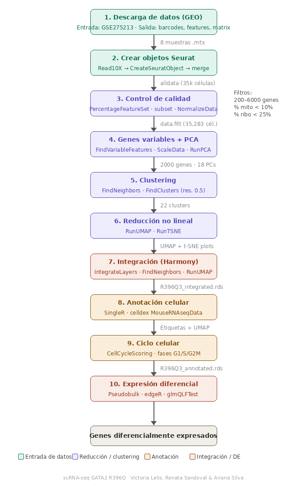

# Análisis transcriptómico de células LSK con mutación R396Q en GATA2 mediante scRNA-seq

título del reporte; integrantes y programa cursado; fecha, materia y semestre; abstract del trabajo; enlace al reporte renderizado; explicación detallada de los pasos y scripts; y referencias utilizadas.

**Autoras:** Victoria Lelis, Renata Sandoval y Ariana Silva

Junio, 2026

**Curso:** Bioinformática aplicada al análisis de transcriptómica diferencial

Octavo semestre de la Licenciatura en Ciencias Genómicas, Universidad Nacional Autónoma de México, Unidad Juriquilla

**Docentes del curso de bioinformática:** Dra. Evelia Coss, Dr. Jerónimo Miranda, Dr. Wilbert Gutiérrez

Este es un repositorio en el que describimos paso a paso el proceso llevado a cabo durante el análisis bioinformático del proyecto enfocado en secuenciación de ARN a nivel de célula única.

Como contexto general del análisis, a continuación se describe el contexto biológico del estudio, las características de los datos analizados y los principales enfoques bioinformáticos empleados para responder las preguntas de investigación planteadas.

## Resumen

En este proyecto se compararon células LSK de ratón de dos grupos: wild type (WT, sin mutaciones) y portadoras de la mutación R396Q en *Gata2*, la cual ha sido asociada en estudios previos con la progresión de la deficiencia de Gata2 hacia leucemia. Los datos analizados son de tipo single-cell RNA-seq (scRNA-seq), generados mediante la plataforma Chromium 10x Genomics (v3.1) y secuenciados con Illumina NovaSeq en modalidad paired-end, a una profundidad mínima de 50,000 lecturas por célula. Para el análisis bioinformático se utilizaron Seurat y Harmony del pipeline original, para el filtrado, normalización, clustering, UMAP, expresión diferencial e integración de réplicas, respectivamente. Adicionalmente, se incorporaron SingleR con celldex para la anotación de tipos celulares, DoubletFinder para detección de dobletes y edgeR para expresión diferencial con enfoque pseudobulk. Se confirmaron genes previamente reportados como sobreexpresados en células mutantes, validando la reproducibilidad del pipeline. Además, se identificaron genes adicionales como Mertk, regulado a la baja en mutantes y vinculado a la señalización y homeostasis en progenitores hematopoyéticos, los cuales complementan lo ya descrito sobre el efecto de la mutación R396Q en *Gata2* y aportan nuevas perspectivas sobre los procesos metabólicos implicados en la transición hacia un estado leucémico.

De la misma manera, se recomienda encarecidamente leer la información general del código en el siguiente [apartado](https://github.com/arianaresi/scRNA-seq-Analysis/tree/main/Descripción/InformacionGeneral.qmd).

## Visión general

**1. Descarga y normalización de datos**

Se inicia con las matrices de cuentas sin procesar (códigos de barras, características, matriz) de 8 muestras (4 WT + 4 mutantes R396Q), mismas que se descargaron directamente de NCBI GEO. Cada muestra se convierte en un objeto Seurat y, a continuación, se fusiona en un único objeto para su análisis de calidad y normalización en conjunto. 

El script .qmd y archivo HTML pueden consultarse [aquí](https://github.com/arianaresi/scRNA-seq-Analysis/tree/main/Descarga%20y%20normalización).

**2. Reducción de dimensionalidad, clustering e integración**

En esta sección se identifican los genes más variables entre células, se reduce la dimensionalidad con PCA y se agrupan las células en clusters. Las poblaciones se visualizan en 2D con UMAP y t-SNE. Finalmente, se usa Harmony para corregir diferencias técnicas entre muestras de distintos ratones sin perder la variación biológica real.

El script .qmd y archivo HTML pueden consultarse [aquí](https://github.com/arianaresi/scRNA-seq-Analysis/tree/main/Reducción%20de%20dimensiones).

**3. Anotación de tipos celulares**

En primer lugar, se realizó la identificación de genes marcadores en cada clúster en comparación con todos los demás (prueba de Wilcoxon). Los resultados se visualizan mediante mapas de calor, diagramas de puntos y diagramas de violín. Después, se pudo implementar la anotación automatizada con SingleR: cada célula se etiqueta automáticamente compara su perfil de expresión con la referencia MouseRNAseqData. Los genes de especial interés se visualizaron en UMAP.

El script .qmd y archivo HTML pueden consultarse [aquí](https://github.com/arianaresi/scRNA-seq-Analysis/tree/main/Anotación%20de%20tipos%20celulares).
  

**4. Análisis de expresión diferencial**

Para comparar la expresión génica entre las condiciones WT y R396Q/+, se utilizó un enfoque de pseudobulk. Las cuentas de todas las células de cada ratón individual se agregan en un único perfil de expresión por muestra. A continuación, se ajustó un modelo GLM con edgeR.

El script .qmd y archivo HTML pueden consultarse [aquí](https://github.com/arianaresi/scRNA-seq-Analysis/tree/main/Análisis%20de%20expresión). Además, en estos archivos también se puede acceder a la discusión y referencias del proyecto.

### Extras

Para una mayor comprensión (y una manera divertida de aprender), también adjuntamos una infografía sobre análisis bioinformático de sc-RNA seq. Haz click [aquí](images/Infografía_singlecell.png) para aprender más con Bibble.

Por último, para una visualización más gráfica de todo el pipeline, adjuntamos un diagrama de flujo. 

Notas: Este pipeline se corrió de manera local, es decir, en los equipos de cómputo de cada una de las integrantes.
